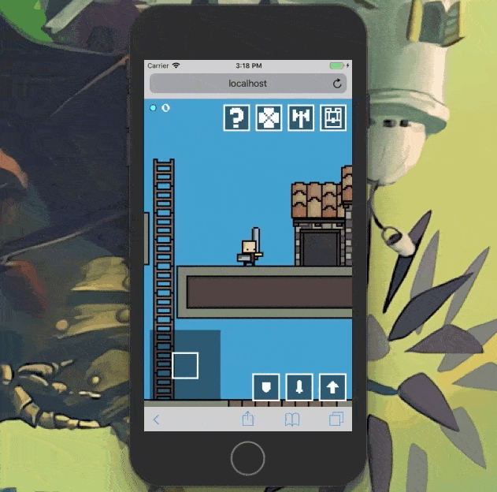

# CS-Engine
engine for building 2D games

> a love story



## Examples

- [bird](http://sean-codes.github.io/cs-engine/example/bird/index.html)
   - flappy bird clone
   - sound demo
- [cube](http://sean-codes.github.io/cs-engine/example/cube/index.html)
   - surfaces for fake lighting
   - GUI surface for interface
   - touch reachable within the game surface
      - drag the crate
   - networking
- [multitouch](http://sean-codes.github.io/cs-engine/example/multitouch/index.html)
   - multiple touch points
   - mouse and touch events can be combined
- [matterjs](https://sean-codes.github.io/cs-engine/example/matterjs/index.html)
   - integrating a 3rd party physics engine

## Boilerplate
```html
<!DOCTYPE html>
<html>
  <head>
    <!-- 1. include cs-engine -->
    <script id="cs-engine" src='../../main.web.js'></script>
  </head>
  <body style="-ms-touch-action: none; touch-action: none">
    <!-- 2. add a canvas -->
    <canvas></canvas>

    <!-- 3. run cs.load with config -->
    <script>

      cs.load({
        path: '../../', // path to parts
        canvas: document.querySelector('canvas'),
        objects: {
          aRectangle: {
            draw: ({ object, cs }) => {
              cs.draw.fillRect({ x: 0, y: 0, width: 50, height: 50 })
            }
          }
        },
        start: ({ object, cs }) => {
          cs.object.create({ type: 'aRectangle' })
        }
      })

    </script>
  </body>
</html>
```

## Initialization
cs.load loads assets and initializes a canvas

```js
/**
 * load function
 * @arg {object} options - the options
 * @arg {string} options.parts - path to cs-engine parts
 * @arg {string} options.canvas - the id of the canvas to use
 * @arg {array of objects} options.sprites - the list of sprites to load
 * @arg {array of objects} options.scripts - the list of sprites to load
 * @arg {array of objects} options.sounds - the list of sounds to load
 * @arg {array of objects} options.storages - the list of storages to load
 * @arg {array of objects} options.objects - initial game objects
 * @arg {function} options.start - called when finished loading
 **/
```

## Sprite Loading Options
When loading sprites we can specify some options. Only path is required

```js
/**
 * sprite load
 * @arg {object} options - the options
 * @arg {string} options.path - the relative path to the .png file
 * @arg {string} [options.name=calculated] - override the filename and set sprite name]
 * @arg {number} [options.frames=0] - how many frames in the sprite sheet
 * @arg {number} [options.width=calculated] - The width of a frame
 * @arg {number} [options.height=calculated] - The height of a frame
 * @arg {number} [options.xoff=0] - The horizontal offset when drawing
 * @arg {number} [options.yoff=0] - The vertical offset when drawing
 * @arg {object} [options.mask=calculated] - And object with { width, height }
 **/

cs.load({
   ...
   sprites: [
      { path: 'sprites/spr_player' },
   ]
})
```

## Script Loading Options
Any `.js` files that are required for the project
```js
/**
 * script load
 * @arg {object} options - the options
 * @arg {string} options.path - the the relative path to the .js file
 **/

cs.load({
   ...
   scripts: [
      { path: './objects/obj_player.js' }
   ]
})
```

## Room
In the start function define the room size.

> note: this can be changed at any time

```js
/**
 * room setup
 * @arg {object} options - the options
 * @arg {number} [options.width] - The width of a room
 * @arg {number} [options.height] - The height of a room
 * @arg {string} [options.background] - The background of the room
 **/

// example room 192px by 192px and a grey background
cs.room.setup({ width: 192, height: 192, background: "#222" })
```


## Camera
The camera defines the area of a non GUI canvas (the game canvas) that should be displayed at anytime.

Experiment with maxWidth and maxHeight and the engine will setup the best scale
to work with those values.

In the start function define the camera settings.

> note: this can be changed at any time

```js
/**
 * camera setup
 * @arg {object} options - the options
 * @arg {number} [options.maxWidth] - The max width of the camera
 * @arg {number} [options.maxHeight] - The max height of the camera
 * @arg {number} [options.smoothing=1] - Amount of smoothing when updating follow position
 **/

// example camera maxWidth and Height
cs.camera.setup({ maxWidth:300, maxHeight:200 })
```

## Game Objects
Game objects have a create, step, and draw function. The are stored in `cs.objects` array. Add them in the init or as external script files.

> in the init

```js
cs.load({
  ...
  objects: {
    myObjName: {
      create: ({ object, cs, attr }) => { console.log('i run when created') },
      step: ({ object, cs }) => { console.log('i run each frame of the game') },
      draw: ({ object, cs }) => { console.log('i run after the step for drawing') }
	 }
  }
  ...
})
```

> External script file

```js
// FILE: objects/obj_name.js
cs.objects.myObjName = {
  create: ({ object, cs, attr }) => { console.log('i run when created') },
  step: ({ object, cs }) => { console.log('i run each frame of the game') },
  draw: ({ object, cs }) => { console.log('i run after the step for drawing') }
}

// Add as script path to assets
cs.load({
   ...
   assets: {
      scripts: [
         { path: 'objects/obj_name.js' }
      ]
   }
   ...
})
```

Create an object using `cs.object.create()`
```js
cs.object.create({
   type: 'obj_name',
   attr: {
      // Attributes to add to the game object example x/y
      x: 50,
      y: 50
   }
})
```

## Drawing

#### Sprites
```js
/**
 * @arg {object} options - the options
 * @arg {string} options.spr - The name of the sprite
 * @arg {number} [options.y] - the y position
 * @arg {number} [options.y] - the y position
 * @arg {number} [options.width=width] - The width to draw the sprite
 * @arg {number} [options.height=height] - The height to draw the sprite
 * @arg {number} [options.scaleX=1] - Horizontal scaling
 * @arg {number} [options.scaleY=1] - Vertical scaling
 * @arg {number} [options.angle=0] - (0 - 360) draw sprite rotated in degrees
 **/

// example drawing player sprite at coordinates (50, 50)
cs.draw.sprite({ spr: 'spr_player', x: 50, y: 50 })
```

#### Text
```js
/**
 * @arg {object} options - the options
 * @arg {string} options.text - The text to draw
 * @arg {number} [options.x] - The x position
 * @arg {number} [options.y] - the y position
 **/

// example drawing text 'hello world' at coordinated (50, 50)
cs.draw.text({ text: 'hello world', x: 50, y: 50 })
```

#### Shapes

###### Fill Recangle
```js
/**
 * @arg {object} options - the options
 * @arg {number} [options.x] - The x position
 * @arg {number} [options.y] - the y position
 * @arg {number} [options.width] - the width
 * @arg {number} [options.height] - the height
 **/

// example fill rectangle in top corner with width 50 and height 50
cs.draw.fillRect({ x: 0, y: 0, width: 50, height: 50 })
```

###### Stroke Rectangle
```js
/**
 * @arg {object} options - the options
 * @arg {number} [options.x] - The x position
 * @arg {number} [options.y] - the y position
 * @arg {number} [options.width] - the width
 * @arg {number} [options.height] - the height
 **/

// example outlined rectangle in top corner with width 50 and height 50
cs.draw.strokeRect({ x: 0, y: 0, width: 50, height: 50 })
```

###### Line
```js
/**
 * @arg {object} options - the options
 * @arg {number} [options.x1] - The start x position
 * @arg {number} [options.y1] - the start y position
 * @arg {number} [options.x2] - the end x position
 * @arg {number} [options.y2] - the end y position
 **/

// example of a line starting in top left corner to (50, 50)
cs.draw.line({ points: [ { x:0, y:0 }, { x:50, y:50 } ] })
```

#### Settings
> Note: Draw settings are reset after any drawing event!

```js
/**
 * @arg {object} options - the options
 * @arg {number} [options.color='#000'] - HEX/RGB/String value of color
 * @arg {number} [options.font='12px Arial'] - Font setting. Font Size space Font Name
 * @arg {number} [options.width=1] - line width for stroke functions
 * @arg {number} [options.alpha=1] - 0 being invisible 1 being fully visible
 * @arg {number} [options.textAlign='start'] - start/middle/end horizontal align
 * @arg {number} [options.textBaseline='top'] - top/bottom/middle/baseline vertical align
 * @arg {number} [options.lineHeight=10] - line height spacing for text
 * @arg {number} [options.operation='source-over'] - set canvas manual on draw operations
 **/

// example setting draw color to red and font to 16px arial
cs.draw.settings({ color: 'red', font: '16px Arial' })
```
